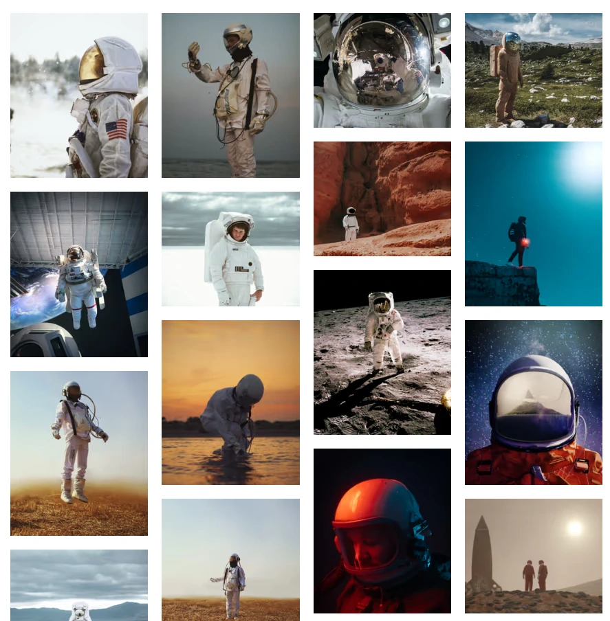

# Working with images

:::class{.aside-right}
In Markdown, you traditionally include images with the following syntax

```md

```

Wouldn't it be cool, to be able to create an [image gallery](/gallery) from just such a list of images?

```md
- 
- 
- 
  ...
  =>
```

Well, you can! And with a bit of magic from **astro-m2dx** and the new [**astro-m2dx-image**](https://www.npmjs.com/package/astro-m2dx-image) it's even easy to make this fully responsive with optimized images.

Come on, let's see how that works step-by-step...

:class{.aside}
:::

> By the way: I am CTO and co-founder of [Hack Your Shack](https://hackyourshack.org), a Berlin-based German non-profit company, that publishes detailed step-by-step instructions for low-tech solutions and makes this actionable open-source knowledge accessible to everyone, especially to everyone that has to live with the hardships of living in a slum in the Global South.  
> If you want to contribute by donating some work hours, we have quite a few well-defined work packages, that would help us speed up our development.  
> [Contact me on Discord (Chris-Adiante#3205)](https://discordapp.com/users/746247173867307038)

## Markdown

Markdown images consist of the `alt` text, the `url` and an optional `title`. Relative paths will usually be resolved relative to the markdown file.

You can't do much else without escaping to embedded HTML, e.g. if you want to set the size of an image, you would need to go about like this

```html

```

## Astro MDX

Using markdown or particularly [MDX in Astro](https://docs.astro.build/en/guides/integrations-guide/mdx/) is great, because it gives you a fantastic publishing pipeline with awesome DX and a blazingly fast output, with full 💯's on Lighthouse score almost out of the box. _Except..._

😰 It just doesn't work like you are used to work: Relative images won't work anymore, you must either move your images to the `public` directory, or you must use the `` as a JSX element and import your image and use the imported image as `src` attribute

```html
import myImg from "./url-to-img.jpg";


```

This is ugly, cumbersome and will make your MDX verbose and technical, but it is due to the fact, that Astro uses Vite as the underlying bundler and Vite expects things slightly different than other environments. But it compensates you with blazing speed.

## astro-m2dx

This is, where **astro-m2dx** comes to the rescue and will derive your intentions from your markdown. Have a [look at all features](/docs), that you can opt-in if you start using astro-m2dx.

The situation can easily be resolved using [`relativeImages`](/docs/#relative-images). With nothing more than that, you can even very easily create the [image gallery](/gallery) that we are after. Have a look at the source code at the bottom of that page. That's all you need.

🌴 Nice! **But...**  
as you would have noticed (if I hadn't already integrated image optimization): The image gallery would be _very🐌 very🐌 very🐌_ slow. Hence, most of us would like to use some form of image optimization.

## @astrojs/image

[**@astrojs/image**](https://docs.astro.build/en/guides/integrations-guide/image/) is still in beta, but it is already a great option to optimize your images and make them fully responsive, except...

😰 It just doesn't work with MDX out of the box.

You **must** use the Image component...  
I haven't looked into it in depth, but @astrojs/image somehow changes the handling of images during site generation, even if you do not use the provided components (`Image` and `Picture`), so that you cannot use the ``-tag anymore.

So, you have to map your MDX images to the Image component, which is done the easiest by activating the **astro-m2dx** feature [`exportComponents`](/docs/#export-components) and providing a file `_components.ts` at the root of your MDX content directory

```ts
import { Image } from '@astrojs/image/components';

export const components = {
  img: Image,
};
```

The `relativeImages` option will respect your component mapping and replace the markdown image elements with the correct custom component.

You also will need to replace all ``-tags in your own components.

Now, you have @astrojs/image optimize your images with default settings, which won't do much, because it cannot derive your intentions unambiguously.

For the gallery, I have implemented a small wrapper, that limits the images' width to 360px. I map all images in MDX files in the gallery directory to this component

```astro
---
import { Image } from '@astrojs/image/components';

const { slot, ...props } = Astro.props;
---

<Image {...props} width={360} />
```

That will already reduce the size of images a lot.

## Responsive images with `<Picture>`

@astrojs/image's `<Picture>` component needs a few more attributes to work properly. It is not trivial to provide these, especially with almost no input from your MDX context.

Hence I wrote a thin wrapper, that derives meaningful defaults for local images, if you do not provide them explicitly. It was a bit brittle to set it up with the `relativeImages` feature, hence I recommend

However, this is a bit brittle, so I recommend:

::CTA[Do not activate ~relativeImages~, activate [`normalizePaths`](/docs/#normalize-paths) and use `<Picture>` from [astro-m2dx-image](https://www.npmjs.com/package/astro-m2dx-image).]

With the default settings, it will resolve all relative paths to absolute paths and allow the `<Picture>` wrapper to read the image metadata for local images.

### Map all your images to the Picture wrapper

```ts
import { Picture } from 'astro-m2dx-image';

export const components = {
  img: Picture,
};
```

This will give you access to next generation image formats 'avif' and 'webp' out of the box.

### Custom `Picture` component

You can easily implement a custom component, by defining some default properties

```astro
---
import { Picture, PictureProps } from 'astro-m2dx-image';

const props = Astro.props as PictureProps;

const customProps: PictureProps = {
  aspectRatio: 1,
  loading: props.class?.includes('eager') ? 'eager' : undefined,
  position: 'attention',
  sizes: '(min-width: 360px) 240px, 100vw',
  widths: [240, 480],
  ...props,
};
---

<Picture {...customProps} />
```

For the property `loading`, you can see a typical pattern, that I use for art direction: I usually derive some properties from classes, that I attach to images, using astro-m2dx `:class`-directive

```md
:class{.eager}
```

### Art direction with `callback`

If you have the need to compute some props based on all defined props including a resolved `src` property (which includes the dimensions for local images), you can configure a `callback` function `(props: PictureProps) => PictureProps`, that can set any property.

A typical use case would be, to limit the aspect ratio to some boundaries.

```astro
---
import { isImageMetadata, parseAspectRatio, Picture, PictureProps } from 'astro-m2dx-image';

const props = Astro.props as PictureProps;

function callback(props: PictureProps): PictureProps {
  const aspetRatioBound = 1.2;
  props.aspectRatio = parseAspectRatio(props.aspectRatio);
  if (!props.aspectRatio) {
    if (props.width && props.height) {
      props.aspectRatio = props.width / props.height;
    } else if (isImageMetadata(props.src)) {
      props.aspectRatio = props.src.width / (props.src.height ?? 1);
    }
  }
  if (props.aspectRatio) {
    props.aspectRatio = Math.min(Math.max(1 / aspetRatioBound, props.aspectRatio), aspetRatioBound);
  }
  return props;
}

const customProps: PictureProps = {
  callback,
  loading: props.class?.includes('eager') ? 'eager' : undefined,
  position: 'attention',
  sizes: '(min-width: 360px) 240px, 100vw',
  widths: [240, 480],
  ...props,
};
---

<Picture {...customProps} />
```

Happy Hacking,

::Signature
