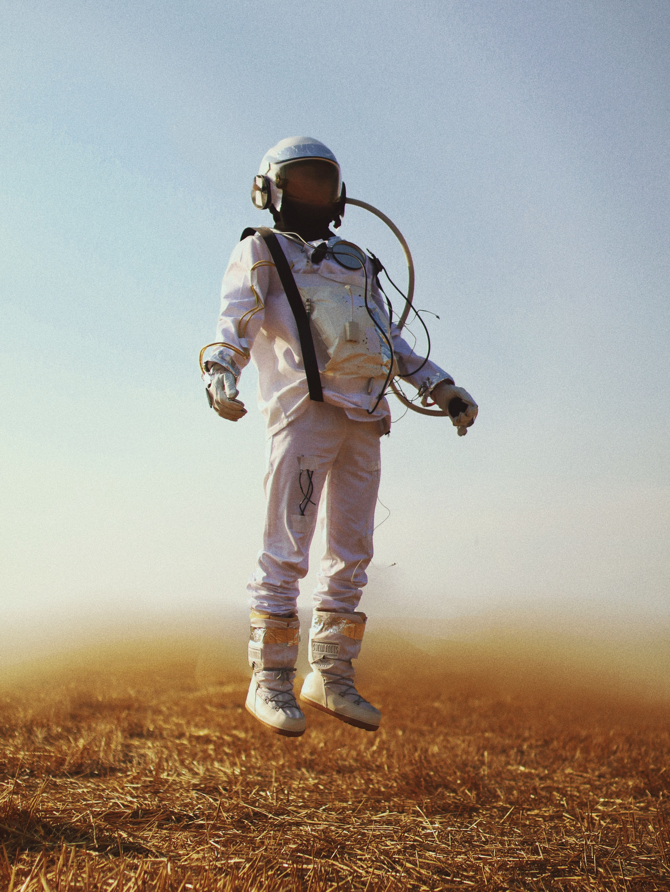
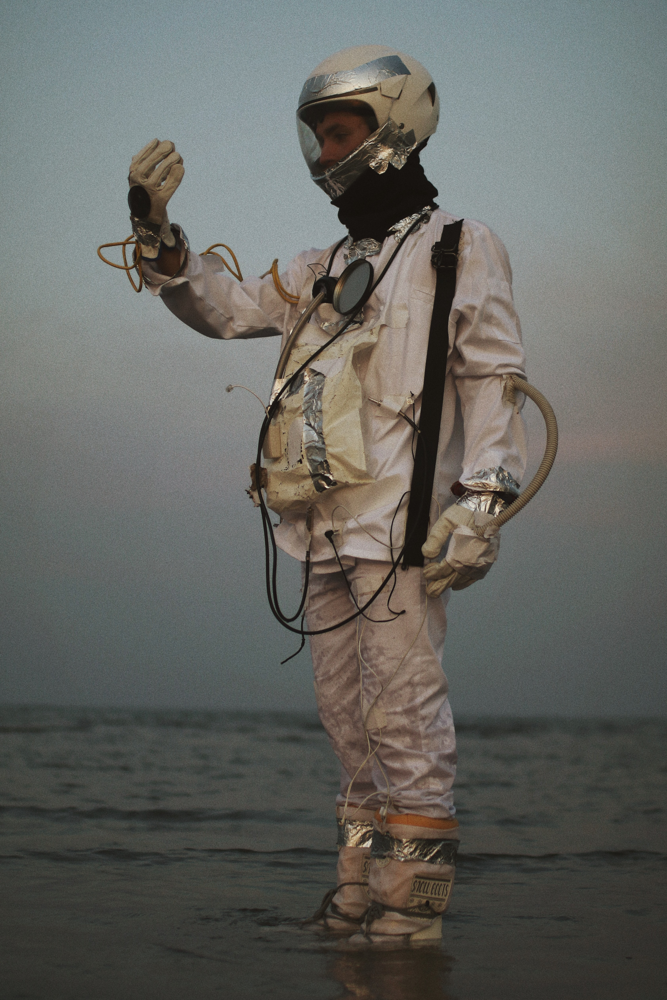
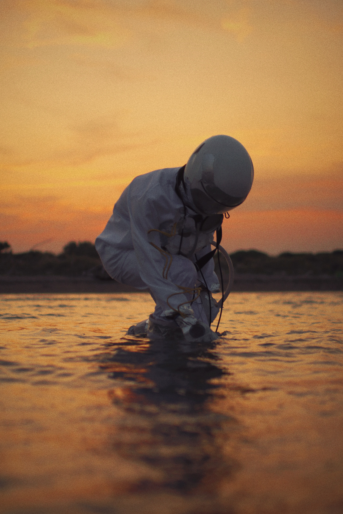
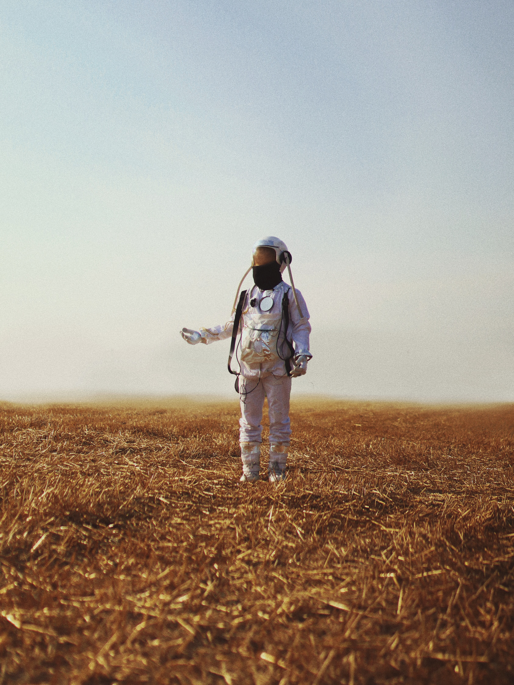
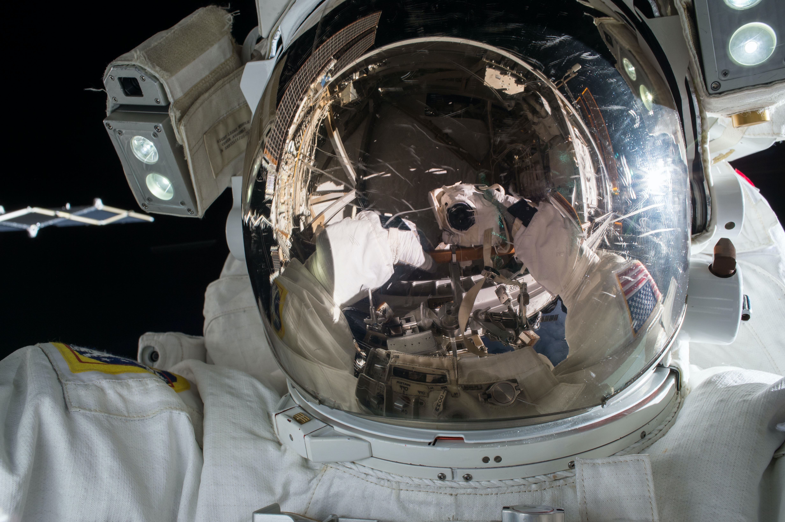
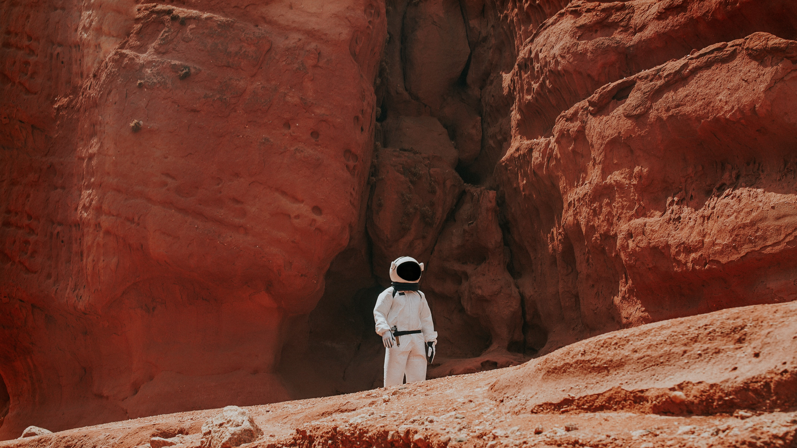
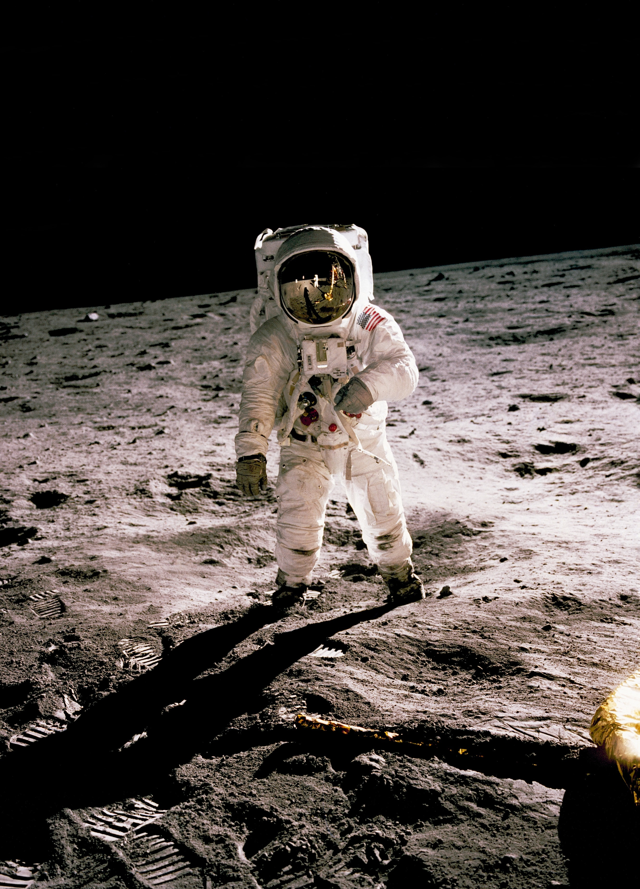
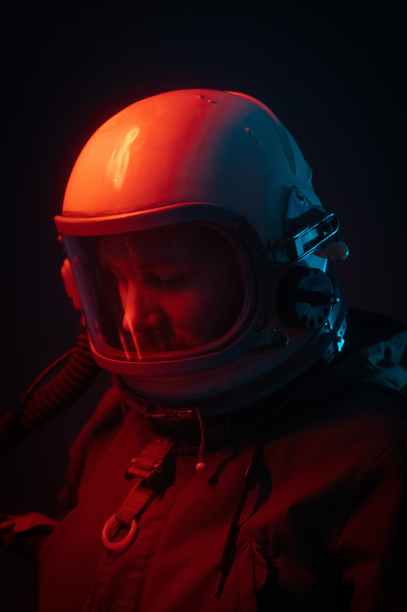

# Image Gallery

Find some nice images that I have pulled from unsplash for demonstration purposes.

::list-class{.image-gallery}

- 
- 
- 
- 
- 
- 
- 
- 
- 
- 
- 
- 
- 
- 
- 
- 

## How to make it...

This image gallery was generated with a tiny snippet of CSS

```css
.image-gallery {
  list-class: none;
  column-width: 150px;
  column-gap: 2rem;
}

.image-gallery img,
.image-gallery li {
  margin: 0;
  padding: 0;
}
.image-gallery img {
  margin-bottom: 2rem;
}
```

and a list of images in MDX (this is the raw MDX of this page, taken from the frontmatter, where it was injected using the feature [`rawMdx`](/docs#inject-raw-mdx))

<Code code={frontmatter?.rawmdx ?? 'Raw MDX not found'} lang="mdx" />
