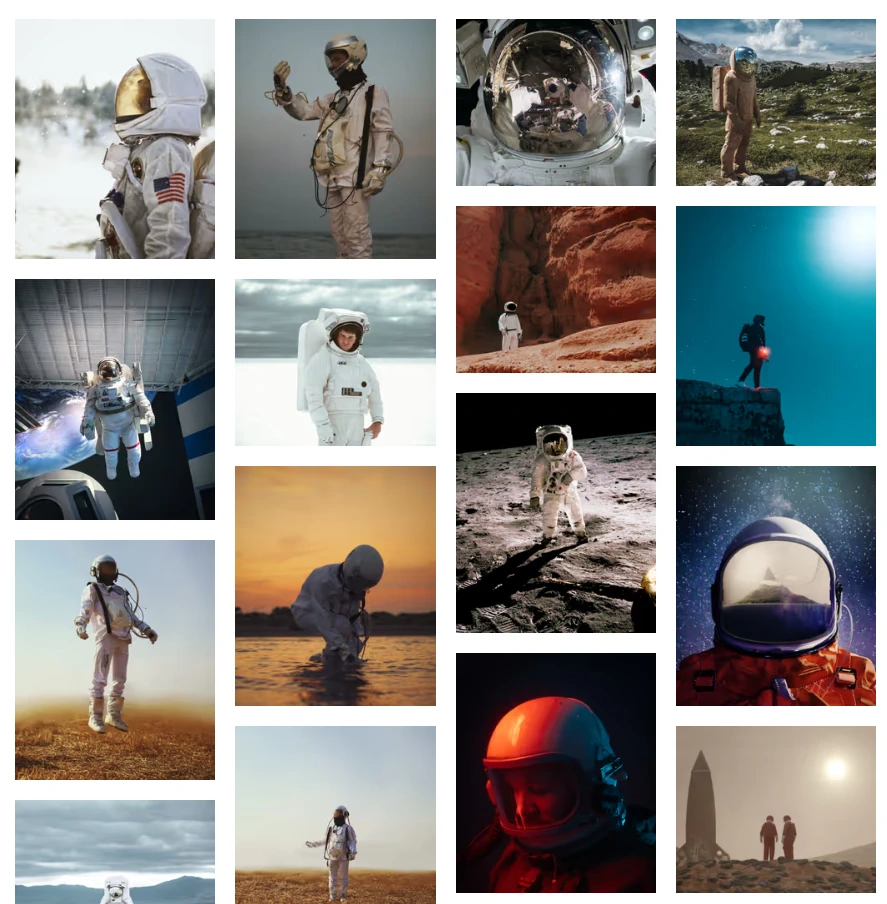

# Working with images

In Markdown, you traditionally include images with the following syntax

```md

```

Wouldn't it be cool, to be able to create an image gallery from just a list of images?

```md
- 
- 
- 
  ...
  =>
```



## Uuuups: The following is work in progress...

Relative paths will be resolved relative to the markdown file.

You can't do much else without escaping to embedded HTML, e.g. if you want to set the size of an image, you would go about like this

```html

```

## Here comes Astro MDX...

😰 It just doesn't work like this: Relative images won't work anymore, you must either move your images to the `public` directory, or you must use the `` as a JSX element and import your image and use the imported image as `src` attribute:

```html
import myImg from "./url-to-img.jpg";


```

This is, what **astro-m2dx** will do for you, if you use [`relativeImages`](/docs#relative-images). With nothing more than that, you can even very easily create an [image gallery](/gallery).

🌴 Nice! **But...**

...as you would have noticed: The image gallery would be _very, very, very_ slow 🐌.

Hence, most of us would like to use some form of image optimization.

## Here comes @astrojs/image...

**@astrojs/image** is still in beta, but it is already great, except...

😰 It just doesn't work with MDX out of the box.

You **must** use the Image component...

I haven't looked into it in depth, but @astrojs/image somehow changes the handling of images during generation, even if you do not use the provided components (namely `Image` and `Picture`), so that you cannot use the ``-tag anymore.

So, you have to map your MDX images to the Image component, which is done the easiest by activating the **astro-m2dx** feature [`exportComponents`](/docs#export-components) and providing a file `_components.ts` at the root of your MDX content directory

```ts
import { Image } from '@astrojs/image/components';

export const components = {
  img: Image,
};
```

You also will need to replace all ``-tags in your own components.

For the gallery, I have implemented a small wrapper, that limits the images' width to 360px. I map all images in MDX files in the gallery directory to this component

```astro
---
import { Image } from '@astrojs/image/components';

const { slot, ...props } = Astro.props;
---

<Image {...props} width={360} />
```

## Coming soon on this channel...

- How to make your images in MDX files truely responsive, using the `Picture` component
- How to apply art direction by combining the above with [`:style` directives](/docs#style-directives)
