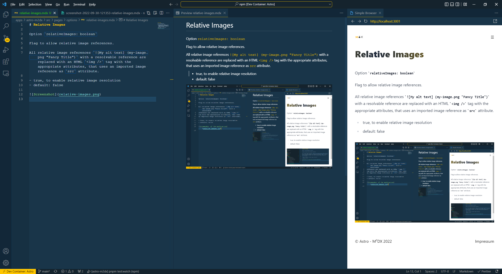

# Relative Images

Option `relativeImages: boolean`

Flag to allow relative image references.

All relative image references `![My alt text] (my-image.png "Fancy Title")` with a resolvable reference are replaced with an HTML `` tag with the appropriate attributes, that uses an imported image reference as `src` attribute.

- true, to enable relative image resolution
- default: false

